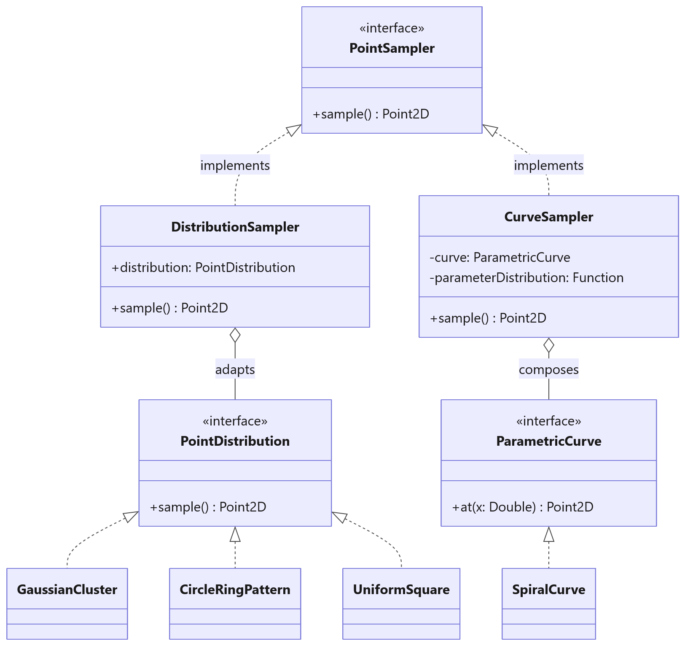
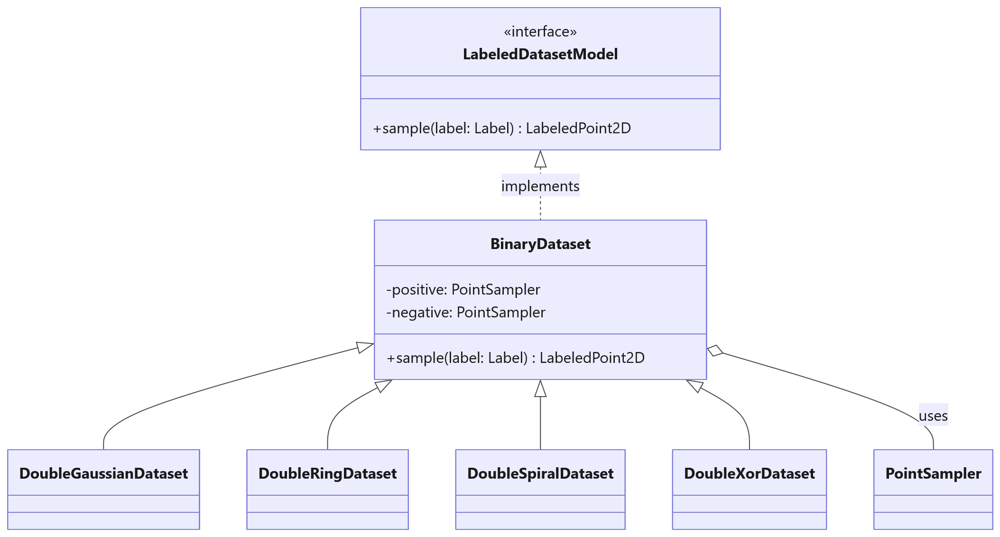
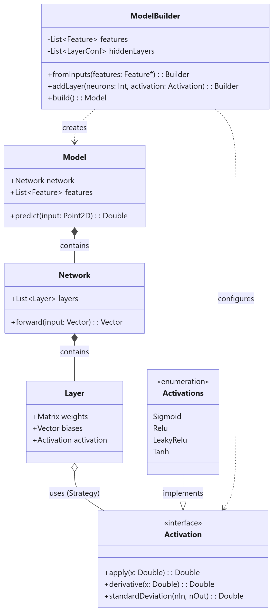
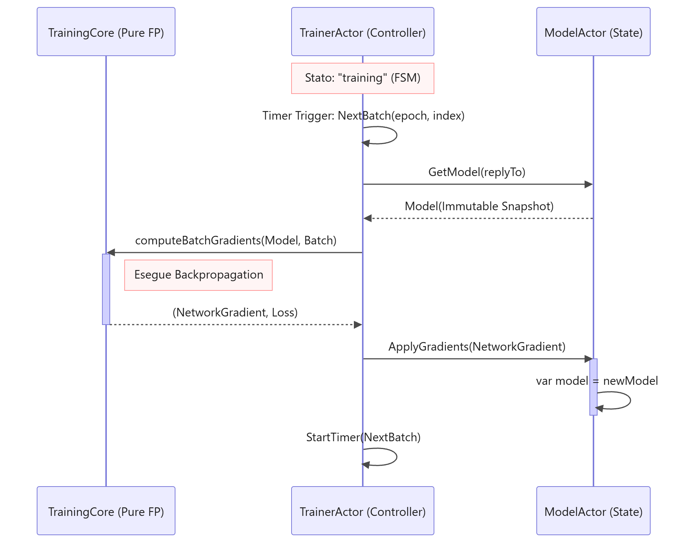
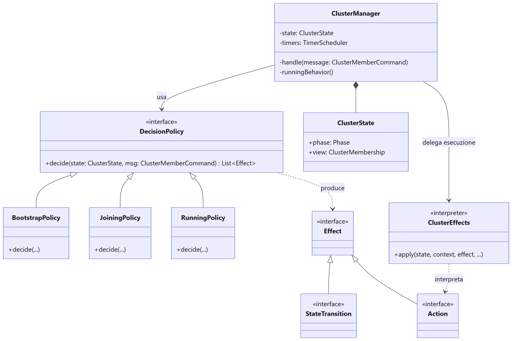
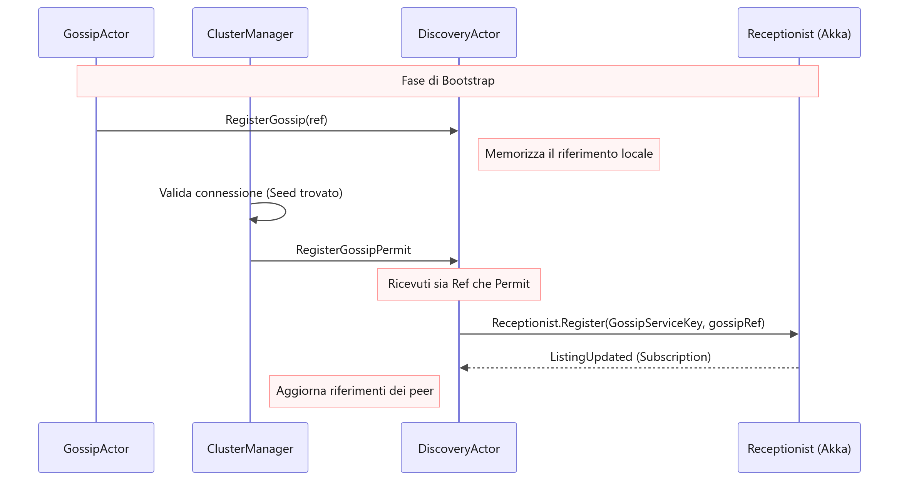
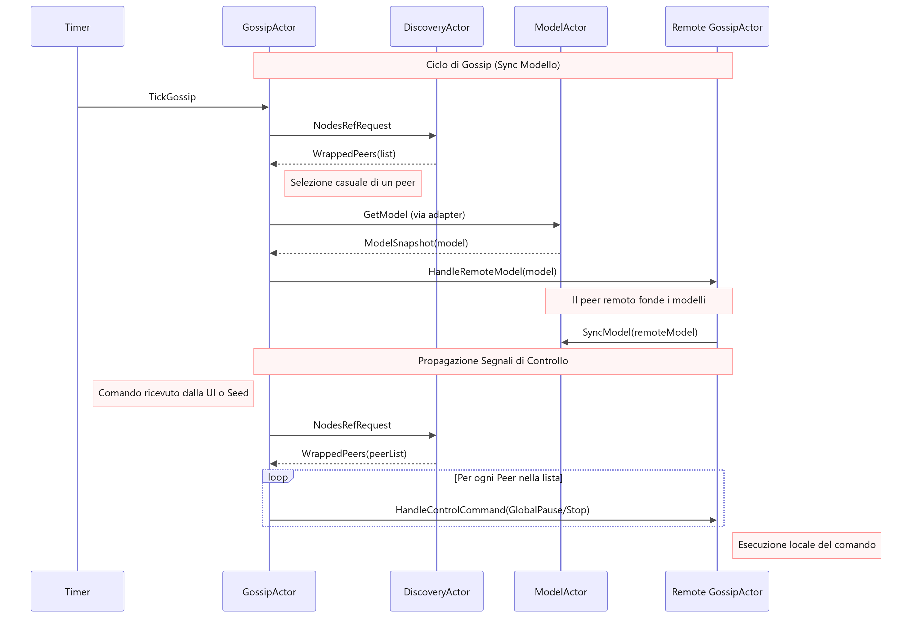
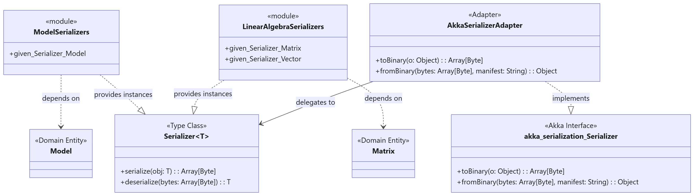
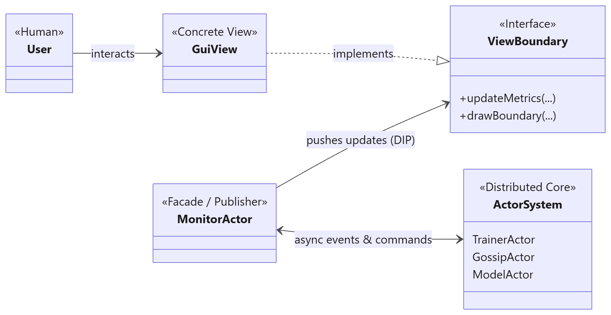

# 4. Design di Dettaglio

Questa sezione dettaglia le scelte di progettazione interne ai moduli del sistema DNTS, illustrando come i principi architetturali di alto livello siano stati declinati attraverso pattern object-oriented e funzionali.

## 4.1 Organizzazione del Codice (Package Structure)

Per riflettere rigorosamente la Separation of Concerns (SOC) delineata nell'architettura, la codebase è stata organizzata in namespace logici ben definiti:

* **`domain`:** Contiene il Pure Functional Core (algebra lineare, strutture della rete neaurale, logica di training, generazione dataset). Questo package non ha alcuna dipendenza da librerie di concorrenza o I/O.
* **`actors`:** Contiene il Distributed & State Layer. Definisce i protocolli, i comportamenti e la gerarchia del sistema ad Attori Akka.
* **`view`:** Costituisce il Boundary Layer, deputato all'interazione con l'utente e al rendering grafico.
* **`config` e `cli`:** Gestiscono il bootstrap, i parametri da terminale e i file di configurazione.

## 4.2 Pure Functional Core

Il package domain si struttura in: `data`, `model`, `common`, `network`, `serialization` e `training`.

### 4.2.1 Il package `data`

Il package è concepito per fornire una pipeline modulare per la generazione di dataset bidimensionali etichettati, strutturata su livelli di astrazione separati: geometria, strategia di campionamento, modellazione etichettata e orchestrazione della generazione. Questa stratificazione viene riflessa nell'organizzazione dei package `pattern`, `sampling`, `dataset` e `util`.
Ogni livello comunica con gli altri esclusivamente tramite interfacce o trait, permettendo di introdurre nuovi modelli o trasformazioni senza impattare la struttura esistente.

#### Livello `pattern`: Geometria e Strategie di Generazione
Il sistema distingue la forma matematica e la logica di produzione dei punti.
* **ParametricCurve:** un'astrazione per curve deterministiche (come la SpiralCurve) definite da una funzione che mappa un parametro reale in un punto 2D.
* **PointDistribution:** definisce una strategia autonoma di generazione (es. GaussianCluster, CircleRingPattern o UniformSquare), che incapsula la logica statistica o geometrica necessaria a produrre un punto 2D.

#### Livello `sampling`: Astrazione del Campionamento
Il package `sampling` introduce il trait PointSampler, che funge da interfaccia unificata per la generazione di punti. Il design adotta due approcci distinti per l'implementazione del campionamento:
1. **Adattamento:** DistributionSampler adatta una PointDistribution esistente all'interfaccia PointSampler.
2. **Composizione:** CurveSampler compone una ParametricCurve con una distribuzione per il suo parametro. Questo permette di variare la densità dei punti lungo una curva senza modificarne la geometria sottostante.

  
   
  <em>Figura 1: Visualizzazione della separazione tra modelli geometrici deterministici (ParametricCurve), strategie statistiche di generazione (PointDistribution) e l'interfaccia unificata di campionamento (PointSampler). </em>

#### Modellazione dei Dataset e Specializzazioni
Al di sopra del campionamento, l'astrazione LabeledDatasetModel definisce il contratto per la generazione di punti associati a una specifica etichetta. Per la gestione di dataset a due classi, è stata introdotta la classe base BinaryDataset. Questa implementa LabeledDatasetModel delegando la produzione dei campioni a due istanze distinte di PointSampler: una dedicata alla classe positiva e una alla negativa. Le implementazioni concrete sfruttano la composizione anziché l'ereditarietà per definire scenari specifici:
* **DoubleGaussianDataset:** compone due GaussianCluster tramite DistributionSampler.
* **DoubleRingDataset:** utilizza due CircleRingPattern per creare aree concentriche.
* **DoubleSpiralDataset:** istanzia due SpiralCurve (una opposta all'altra) gestite da CurveSampler.
* **DoubleXorDataset:** sfrutta lo XorSampler, un campionatore specializzato che alterna la generazione tra quadranti opposti definiti da UniformSquare.

  
   
  <em>Figura 2: Struttura gerarchica dei modelli di dataset basata sull'astrazione BinaryDataset. Viene illustrato come le specializzazioni concrete (Gaussian, Ring, Spiral, Xor) utilizzino la composizione di due istanze di PointSampler.</em>

#### Trasformazioni, Vincoli e Calcolo Dinamico
Il design include meccanismi per garantire che i punti generati rispettino i vincoli spaziali e possano essere manipolati post-generazione.
* **Gestione dello Spazio (Space e Domain):** La classe Space definisce i confini del mondo 2D, fornendo un metodo di clamping per riportare punti esterni entro i limiti ammissibili. Il Domain rappresenta invece un intervallo generico di valori reali.
* **Rumore:** L'interfaccia Noise permette di applicare perturbazioni ai punti. L'implementazione NoiseWithDistribution permette di iniettare rumore statistico (es. Gaussiano) rispettando i vincoli di Space tramite il clamping automatico dei risultati.

#### Creazione Centralizzata e Orchestrazione
Per semplificare l'utilizzo del sistema e garantire la riproducibilità, sono stati introdotti componenti di gestione centralizzata.
* **DataModelFactory (Pattern Factory):** Questo oggetto ha il compito di istanziare il modello di dataset corretto a partire da una configurazione (DatasetStrategyConfig). Gestisce inoltre il determinismo: centralizza la derivazione dei semi casuali (seeds), garantendo che ogni componente riceva un seme coerente ma distinto.
* **DatasetGenerator:** Si occupa della costruzione materiale della lista di punti etichettati. Delega la logica di campionamento al modello e offre funzionalità di post-elaborazione come lo shuffling e l'applicazione del rumore.

#### Riepilogo Pattern e Principi di Progettazione
In sintesi, il design si fonda sui seguenti pattern di progettazione:
* **Strategy:** per rendere intercambiabili le modalità di campionamento e le trasformazioni di rumore.
* **Adapter:** per integrare diverse strategie di distribuzione nell'interfaccia di campionamento.
* **Factory:** per disaccoppiare la logica di configurazione dalla creazione degli oggetti.
* **Dependency Inversion:** i componenti di alto livello (DatasetGenerator) dipendono solo da astrazioni (LabeledDatasetModel), mai dalle implementazioni concrete delle curve o delle distribuzioni.

### 4.2.2 Core Matematico e Astrazione della Rete Neurale

Questa sezione descrive la progettazione del livello base del sistema: l'algebra lineare e la topologia della rete neurale. L'obiettivo primario è stato garantire la purezza funzionale e l'immutabilità totale. Poiché lo stato del modello predittivo deve essere continuamente scambiato e aggiornato tra attori concorrenti, si è deciso di modellare queste entità come strutture dati immutabili rendendo la concorrenza sicura.

#### Astrazioni per l'Algebra Lineare
Per evitare l'anti-pattern della Primitive Obsession (ovvero l'abuso di array o collezioni generiche per rappresentare concetti complessi), è stato disegnato un dominio matematico dedicato a matrici e vettori. Il design adotta il principio dell'incapsulamento spinto: la reale rappresentazione in memoria dei dati viene nascosta, offrendo all'esterno unicamente un Domain-Specific Language (DSL) per le operazioni algebriche. Ogni operazione matematica non altera mai gli operandi, ma genera una nuova istanza.

#### Topologia della Rete Neurale
La rete neurale è modellata tramite un approccio composizionale gerarchico (il Modello aggrega la Rete, che a sua volta aggrega una sequenza di Layer). Tali entità sono puri aggregati strutturali deputati unicamente all'inferenza (forward pass).
Per garantire flessibilità matematica, il comportamento dei singoli strati è regolato dal pattern Strategy: le funzioni di attivazione sono modellate come interfacce intercambiabili. Questo permette di iniettare dinamicamente diverse logiche (es. Sigmoide, ReLU) senza dover modificare le classi strutturali della rete.

La creazione stessa della topologia della rete neurale è un processo a più step (definizione feature, aggiunta di N hidden layers, applicazione di complesse euristiche per l'inizializzazione pesi). Per isolare questa complessità, è stato utilizzato il pattern creazionale Builder, che accumula la configurazione internamente e restituisce infine una struttura dati immutabile corretta.

  
   
  <em>Figura 3: Struttura composizionale e pattern creazionali del Dominio e della Rete Neurale.</em>

## 4.3 Distributed & State Layer

### 4.3.1 Motore di Addestramento e Controllo
Questo modulo è responsabile dell'avanzamento della simulazione: processa il dataset, calcola l'errore del modello e ne aggiorna i pesi. Al fine di rispettare il requisito SOC, il suo design è stato nettamente diviso in due macro-aree: un nucleo matematico puro e un controllore reattivo ad attori.

#### Il Dominio Funzionale dell'Addestramento
Il calcolo matematico dell'addestramento (feed-forward, calcolo dell'errore e backpropagation) è stato modellato come una pipeline di funzioni pure. Invece di far mutare i pesi della rete, l'algoritmo di Backpropagation si limita a calcolare e restituire i gradienti (le variazioni da applicare) sotto forma di strutture dati immutabili.
Per gestire la variabilità degli iperparametri, si è fatto largo uso del pattern Strategy:
* **Euristiche Intercambiabili:** Componenti come la Loss Function (es. Mean Squared Error), gli Ottimizzatori (es. Stochastic Gradient Descent) e i meccanismi di Regolarizzazione (L1, L2, ElasticNet) sono modellati come interfacce funzionali. Le implementazioni concrete vengono iniettate a runtime in base alla configurazione iniziale, garantendo il Open/Closed Principle del core matematico rispetto a aggiunte future.
* **Facade Computazionale:** Per evitare che il livello ad attori debba orchestrare manualmente i passaggi matematici sui singoli punti del dataset, è stato introdotto un oggetto TrainingCore che funge da Facade. Questo componente riceve il batch di dati e il modello corrente, delega il calcolo della retropropagazione, e restituisce i gradienti mediati pronti per l'applicazione.

#### TrainerActor come Macchina a Stati (FSM)
Il ciclo di vita dell'addestramento (epoche e batch) nel TrainerActor non può essere implementato con loop tradizionali, poiché bloccherebbero l'attore impedendogli di gestire i messaggi di rete (come il protocollo Gossip) o i comandi utente.
Per ovviare a questo problema, il TrainerActor è stato progettato adottando il pattern architetturale delle Macchine a Stati Finiti (FSM), nativamente supportato dal paradigma Behavior di Akka Typed:
1. **Transizioni di Stato:** Il comportamento dell'attore muta attraversando stati ben definiti: Idle (attesa delle dipendenze), Ready (configurazione ricevuta), Training (loop di calcolo attivo) e Paused (sospensione su richiesta dell'utente). In ogni stato, l'attore reagisce solo ai messaggi pertinenti, scartando o ignorando comandi invalidi.
2. **Loop di Addestramento Asincrono:** Il ciclo sui batch di dati non è continuo, ma è scandito dall'invio asincrono di messaggi a se stesso e da un sistema di Timer. Al termine del calcolo di un batch, l'attore programma l'elaborazione del successivo. Questo design garantisce che, tra un batch e l'altro, la coda dei messaggi dell'attore sia libera di processare altri eventi prioritari (come le richieste di misurazione delle metriche e i comandi utente) mantenendo il sistema altamente responsivo.

  
   
  <em>Figura 4: Diagramma di sequenza che illustra il loop asincrono di addestramento.</em>

### 4.3.2 Gestione del Cluster: ClusterManager

Il design del sottosistema di gestione del cluster è orientato alla creazione di un'infrastruttura **decentralizzata e resiliente**, capace di operare in una rete **peer-to-peer (P2P)** senza la necessità di un coordinatore centrale. 

#### Organizzazione del Codice e Modularità
Il codice è strutturato in package che riflettono una **Separazione delle Responsabilità**, facilitando la manutenibilità e il testing isolato delle componenti:

*   **`actors.cluster`**: Costituisce il nucleo del modulo, contenendo l'attore principale (`ClusterManager`), lo stato globale (`ClusterState`) e il protocollo di comunicazione (`ClusterProtocol`).
*   **`actors.cluster.membership`**: Incapsula la logica pura di gestione della vista locale del cluster e le politiche di aggiornamento dei membri.
*   **`actors.cluster.effect`**: Definisce il linguaggio degli "effetti", ovvero le azioni atomiche che il sistema può intraprendere come reazione agli eventi.
*   **`actors.cluster.adapter`**: Gestisce la traduzione tra le strutture dati native di Akka Cluster e il dominio applicativo.
*   **`actors.cluster.timer`**: Centralizza la gestione dei timeout e delle chiavi dei timer per il monitoraggio dei guasti.

#### Modellazione delle Entità e Pattern di Progettazione
Il design si avvale di pattern consolidati per gestire la complessità dei sistemi distribuiti.
* Il `ClusterManager` è modellato come una **FSM** che attraversa tre fasi: `Bootstrap`, `Joining` e `Running`. Il comportamento dell'attore cambia dinamicamente in base alla fase attiva, delegando la logica a diverse politiche decisionali.
* L'intero processo decisionale segue il pattern **Strategy**. Ogni fase è regolata da una `DecisionPolicy` specifica (`BootstrapPolicy`, `JoiningPolicy`, `RunningPolicy`). Le policy sono componenti pure: ricevono lo stato e un messaggio e restituiscono una lista di `Effect`. Questo garantisce **determinismo** e facilita il testing.
* Gli effetti prodotti dalle policy vengono elaborati da `ClusterEffects`, che funge da **Interprete**. Questo componente costituisce la "shell" imperativa che interagisce con il "mondo" esterno (invio messaggi verso gli altri attori, gestione timer, chiamate alle API di Akka).
* Per disaccoppiare il sistema dalle API di Akka, è stato implementato l'**Adapter Pattern**. L'uso della **Typeclass** `HasMember` permette di estrarre in modo polimorfico informazioni sui membri da eventi eterogenei (Up, Removed, Reachable), convertendoli nel modello di dominio `ClusterNode`.
* La gestione della membership utilizza uno **stato immutabile**. Ogni operazione di aggiunta, rimozione o modifica della raggiungibilità produce una nuova istanza della membership, garantendo thread-safety e la tracciabilità delle transizioni.

  
   
  <em>Figura 5:  Macchina a stati finiti del ClusterManager. Rappresentazione del ciclo di vita del nodo attraverso le fasi di Bootstrap, Joining e Running, con evidenza delle transizioni basate sulla rilevazione del Seed e sulle politiche di timeout.</em>

#### Design Peer-to-Peer e Resilienza
Il design riflette la natura P2P e l'esigenza di resilienza attraverso meccanismi di controllo distribuito.
* In linea con il paradigma P2P, **ogni nodo interpreta lo stato della rete autonomamente**. Non esiste un'autorità centrale che impone la visione del cluster; ogni `ClusterManager` mantiene la propria `ClusterMembership` locale basata sugli eventi osservati direttamente.
* Il design garantisce la consistenza delle operazioni critiche senza sacrificare il decentramento. Ad esempio, l'effetto `DownNode` (espulsione di un nodo) viene generato da qualsiasi peer che rilevi un fallimento, ma l'esecuzione dell'azione è condizionata: ogni nodo verifica localmente se è il **Leader corrente** del cluster prima di procedere con il comando effettivo. Questo garantisce che l'azione sia intrapresa da un solo coordinatore temporaneo eletto dinamicamente dalla rete.
* La resilienza non è statica, ma si adatta alla fase operativa:
  *   **Fase di Joining (Fail-Fast)**: Il design privilegia la crescita del cluster. I nodi irraggiungibili vengono rimossi immediatamente (`DownNode`) per evitare che blocchino l'ingresso di nuovi membri, una limitazione intrinseca del protocollo di Akka Cluster.
  *   **Fase di Running (Autonomia e Tolleranza)**: Una volta avviata la simulazione, i nodi diventano funzionalmente autonomi. Se un peer diventa irraggiungibile, viene atteso un tempo di timeout (`UnreachableTimeout`) per permettere un recupero spontaneo senza perturbare la topologia.
* Il design gestisce il nodo Seed in modo ibrido. Sebbene sia fondamentale come punto di contatto iniziale e fornitore di dati durante il `Bootstrap`, una volta raggiunta la fase di `Running` esso viene trattato come un **peer paritario**: coerentemente con la natura P2P, la perdita di connettività con il Seed in fase operativa non causa l'arresto del nodo locale, poiché ogni partecipante dispone ormai di tutte le informazioni necessarie per proseguire autonomamente la simulazione.

### 4.3.3 DiscoveryActor
Il DiscoveryActor agisce come un intermediario tra l'infrastruttura di rete di Akka e la logica applicativa. Mentre il ClusterManager si occupa della salute dei nodi a livello di rete, il DiscoveryActor gestisce la raggiungibilità dei servizi a livello di attori.
Le sue responsabilità principali includono:
* **Sottoscrizione al Receptionist:** Monitoraggio dinamico di tutti gli attori che espongono il servizio di gossip nel cluster.
* **Validazione della Topologia:** Filtro dei riferimenti scoperti per garantire che solo i nodi considerati "validi" e "attivi" dal ClusterManager siano esposti al resto del sistema.
* **Service Advertising:** Registrazione protetta del servizio di gossip locale una volta che il nodo ha completato le fasi iniziali di bootstrap.

#### Design dello Stato: GossipPeerState
Lo stato dell'attore, incapsulato in GossipPeerState, segue i principi dell'immutabilità e della separazione dei domini.
* **Doppia Sorgente di Verità:** Lo stato mantiene due insiemi distinti:
  * **knownReferences:** L'elenco "grezzo" di tutti gli attori scoperti tramite il Receptionist di Akka.
  * **acceptedNodes:** L'elenco degli indirizzi di rete (Address) che il ClusterManager ha esplicitamente validato come parte integrante e funzionante della simulazione.
* **Pattern Filter/Gateway:** La funzione acceptedReferences applica un filtro di intersezione: un ActorRef è considerato utilizzabile solo se il suo indirizzo appartiene all'insieme dei nodi accettati o se è locale. Questo garantisce che i messaggi di gossip non vengano inviati a nodi non ancora pronti.

#### Pattern di Progettazione e Interazione
* **Observer Pattern (Subscription):** Il DiscoveryActor implementa il pattern Observer nei confronti del Receptionist (Akka) di sistema. All'avvio, l'attore non interroga passivamente il registro, ma si sottoscrive a una ServiceKey specifica (gossip-service). Ogni variazione nella rete (nuovi attori o attori rimossi) viene notificata asincronamente.
* **Adapter Pattern per i Messaggi di Sistema:** Il DiscoveryActor utilizza un Message Adapter per tradurre le risposte native del Receptionist (Receptionist.Listing) in messaggi definiti nel proprio protocollo interno (ListingUpdated).

  
   
  <em>Figura 6: Diagramma di sequenza del meccanismo di Permit. Coordinamento temporale tra il ClusterManager e il DiscoveryActor per garantire che la registrazione del servizio di Gossip nel Receptionist avvenga solo dopo la validazione della connettività iniziale.</em>

### 4.3.4 Gestione del Modello e dello Stato (ModelActor)

Il ModelActor costituisce il fulcro del sistema per quanto concerne la gestione dello stato della rete neurale. Il suo obbiettivo principale è agire come custode del modello predittivo, garantendo la coerenza dei pesi durante l'addestramento e la sincronizzazione distribuita.

#### Incapsulamento dello Stato tramite Attori

In linea con il paradigma Akka Typed, il ModelActor è modellato come una macchina a stati finiti (FSM) per eliminare la necessità di lock o variabili mutabili condivise.
L'attore è composto da 2 diverse fasi: Idle e Active. 
* La fase **Idle** si occupa della inizializzazione dell'attore.
* La fase **Active** si occupa di:
  * **applicare i gradienti** al model e quindi aggiornare i pesi della rete locale passati dal TrainingActor.
  * effettuare il **merge** della propria rete locale con quella ricevuta dal gossip.

#### Pattern State per il Model

Per mantenere il codice dell'attore focalizzato esclusivamente sul protocollo di comunicazione, la logica di manipolazione della rete è delegata al componente ModelTasks. Il design adotta il Pattern State (astratto tramite una Monade di Stato):
le operazioni di aggiornamento (es. applicazione dei gradienti o fusione tra modelli) sono descritte come trasformazioni pure State[Model, A].
Questo approccio permette di definire "cosa" deve accadere al modello separatamente da "quando" l'attore decide di applicare tale modifica, facilitando il testing della logica matematica senza dover istanziare l'intero sistema ad attori.

#### Sincronizzazione del Model
Il ModelActor orchestra la convergenza del sistema distribuito gestendo l'interazione tra i contributi locali (trainer) e globali (gossip).
Per effettuare il merge tra la propria rete e un'altra remota, ricevuta dal gossip, viene eseguita una media dei parametri (pesi e bias) tra la rete locale e quella remota.

### 4.3.5 Il Livello di Comunicazione P2P
Il package `actors.gossip` costituisce il cuore dell'infrastruttura di rete *peer-to-peer* (P2P) del sistema. Ha il duplice compito di garantire la convergenza dei modelli predittivi distribuiti (Gossip Learning) e di orchestrare il ciclo di vita della simulazione (bootstrap, pausa, terminazione) senza l'ausilio di un coordinatore centrale.
Per gestire l'elevata complessità derivante dalla natura asincrona e distribuita di queste operazioni, il design del sottosistema è stato fortemente modularizzato. Invece di concentrare tutte le responsabilità in un unico Actor, la logica è stata scomposta in attori specializzati, coordinati da un attore router principale.

#### Architettura Modulare (`GossipActor`)
Il `GossipActor` funge da punto di ingresso (Gateway) per le comunicazioni P2P del nodo. 
Riceve messaggi generici dal protocollo gossip e li instrada ai sottomoduli di competenza (`ConfigurationActor`, `DatasetDistributionActor`, `ConsensusActor`), disaccoppiando la ricezione dei messaggi dalla loro effettiva elaborazione.
Il `GossipActor` gestisce in prima persona la logica core dell'algoritmo di Gossip:
* **Push-based Sync:** Tramite un sistema basato su timer periodici (`TickGossip`), l'attore interroga il sistema di Discovery per ottenere la lista dei peer attivi, ne seleziona uno in modo pseudo-casuale e gli invia il proprio stato locale del modello. Questo approccio probabilistico garantisce, nel tempo, la diffusione dell'informazione e la convergenza del cluster.
* **Propagazione dei Segnali di Controllo:** Il protocollo prevede comandi per il controllo globale della simulazione (come `GlobalPause`, `GlobalResume`, `GlobalStop`). Il `GossipActor` si occupa di intercettare questi messaggi e diffonderli verso gli altri peer, per poi applicarne gli effetti sui sottomoduli locali.

#### Bootstrap Distribuito (`ConfigurationActor`)
L'avvio di un sistema distribuito richiede che tutti i nodi condividano la stessa configurazione iniziale (architettura della rete e iperparametri), originariamente generata dal nodo Seed. Il design del `ConfigurationActor` affronta questo problema adottando un pattern di **Polling Attivo con Caching**:
* **Fase di Attesa:** All'avvio, i nodi client non possiedono la configurazione. L'attore instaura un ciclo di polling periodico interrogando i vicini finché non riceve i parametri iniziali. Questo design impedisce che un nodo inizi ad addestrare una rete neurale non compatibile con il resto del cluster.
* **Caching e Propagazione:** Una volta ricevuta, la configurazione viene salvata nello stato interno dell'attore (`cachedConfig`). Da questo momento, il nodo smette di richiedere la configurazione e diventa a sua volta una potenziale fonte (Seed secondario) per i nuovi nodi che si uniscono tardivamente al cluster, garantendo scalabilità in fase di bootstrap.

#### Pattern Scatter-Gather e Tolleranza ai Guasti (`ConsensusActor`)
Per monitorare l'andamento del Gossip Learning, il sistema deve calcolare quanto le reti neurali dei vari nodi divergano tra loro (Consenso Globale). Essendo un sistema P2P, nessun nodo ha la visione globale istantanea della rete. Il `ConsensusActor` risolve questo problema implementando il pattern architetturale **Scatter-Gather** strutturato in "Round" (epoche di consenso):
* **Scatter (Dispersione):** A intervalli regolari, l'attore avvia un nuovo `ConsensusRoundState`, registrando il proprio modello locale e inviando una richiesta di snapshot a *tutti* i peer attualmente visibili nella rete.
* **Gather (Raccolta):** L'attore accumula le risposte in modo asincrono, verificando che appartengano al Round corretto tramite un identificativo univoco (`roundId`). Questo accorgimento progettuale impedisce che messaggi arrivati in ritardo da round precedenti inquinino il calcolo corrente.
* **Resilienza tramite Timeout:** In un sistema distribuito, i peer possono fallire o subire ritardi di rete. Per evitare che il nodo rimanga bloccato in attesa infinita di una risposta mancante, il design include un timer di timeout. Allo scadere del timer, il consenso viene forzatamente calcolato utilizzando unicamente i modelli ricevuti fino a quel momento, privilegiando la *Liveness* del sistema rispetto alla consistenza assoluta dell'interfaccia grafica.

#### Segmentazione dei Dati (`DatasetDistributionActor`)
Parallelamente alla configurazione, il cluster deve distribuire il set di dati da analizzare. Il `DatasetDistributionActor` è stato progettato come un modulo autonomo che intercetta i comandi di distribuzione generati dal nodo Seed, all'avvio della simulazione. Questo disaccoppiamento garantisce che la logica di partizionamento dei dati non interferisca con lo scambio continuo dei modelli predittivi, mantenendo pulita l'architettura dei flussi dati.

  
   
  <em>Figura 7: Diagramma di sequenza del sottosistema Gossip.</em>

### 4.3.6 Orchestrazione e Bootstrap del Nodo: RootActor
Il RootActor funge da vertice gerarchico e supervisore di sistema per ogni singola istanza del software DNTS. 
La sua responsabilità primaria risiede nel coordinare il ciclo di vita degli attori locali e nel gestire la transizione critica tra la fase di inizializzazione e quella operativa, garantendo che il nodo si integri correttamente nel cluster distribuito.
Il RootActor isola l'infrastruttura di base dal resto dell'applicazione.
Esso ha il compito di istanziare e monitorare i componenti core (ModelActor, TrainerActor, GossipActor, ecc.), agendo come unico punto di smistamento per i segnali di controllo globali.
Questo design permette di gestire eventuali fallimenti dei componenti figli senza compromettere la stabilità dell'intero nodo.
L'architettura del RootActor adatta la logica di bootstrap in base al ruolo (NodeRole) specificato in fase di avvio, ovvero nodo Seed o nodo Client.
Il RootActor, infine si deve occupare di richiamare lo stop degli attori e di aspettare il loro termine, usando una deallocazione forzata degli attori in caso di necessità.

  
   
  <em>Figura 8: Diagramma delle classi RootActor e sottosistema Gossip.</em>

## 4.4 Livello di Serializzazione

La natura P2P dell'architettura e l'algoritmo di Gossip Learning richiedono che i nodi si scambino ripetutamente lo stato dei propri modelli predittivi. Le entità scambiate possono essere di grandi dimensioni. Per ottimizzare le performance di rete e ridurre la latenza, il sistema adotta una serializzazione binaria custom, evitando formati verbosi o meccanismi di serializzazione standard inefficienti.
Il design di questo livello è stato guidato dalla necessità di preservare il pure functional core, che non deve avere conoscenza del fatto che i suoi oggetti verranno inviati su una rete, né dipendere da librerie dell'infrastruttura.

### 4.4.1 Disaccoppiamento tramite Type Classes
Per evitare di accoppiare le classi di dominio con interfacce dedicate o con metodi intrusivi, la logica di conversione è stata estratta utilizzando il pattern funzionale delle Type Classes.
Il design prevede la definizione di un'interfaccia generica Serializer[T] pura. Le implementazioni specifiche per i vari tipi di dato (es. LinearAlgebraSerializers, NetworkSerializers, GossipSerializers) sono fornite come istanze implicite in moduli separati dal dominio.
Questo approccio garantisce la massima flessibilità e componibilità: il serializzatore di una rete neurale non fa altro che comporre i serializzatori dei singoli layer, che a loro volta richiamano i serializzatori delle matrici, in modo totalmente modulare e dichiarativo.

### 4.4.2 Integrazione con l'Infrastruttura
L'integrazione della serializzazione personalizzata in Akka richiede l'estensione di classi proprietarie. Per evitare di accoppiare l'intera codebase a queste dipendenze è stato introdotto un Boundary Component basato sul pattern Adapter (AkkaSerializerAdapter).
Questo componente funge da ponte architetturale: implementa le interfacce richieste dal framework di rete, ma delega l'effettiva logica di (de)serializzazione a moduli indipendenti.

  
   
  <em>Figura 9: Disaccoppiamento della logica di serializzazione tramite Type Classes e Adapter.</em>

## 4.5 Monitoraggio e Interazione con l'Utente

Questo modulo ha la responsabilità di estrarre le metriche (loss, consenso, andamento della rete) dal cluster distribuito e renderle disponibili all'utente, permettendo al contempo di inviare comandi di controllo (start, pause, stop). Il design è stato progettato tenendo conto di un netto disaccoppiamento tra l'infrastruttura reattiva di Akka e il livello di presentazione.

### 4.5.1 MonitorActor come Gateway
Per evitare che la logica della View debba comunicare direttamente con i singoli attori operativi è stato introdotto il MonitorActor. Questo componente agisce a tutti gli effetti come un Facade e un Bridge architetturale:
* **Aggregazione Event-Driven:** Il MonitorActor non effettua polling verso gli altri attori per ottenere le metriche. Al contrario, si iscrive al flusso di eventi del sistema e riceve aggiornamenti in modo totalmente asincrono (es. riceve la notifica di un nuovo calcolo dell'errore o di un aggiornamento del modello distribuito).
* **Inoltro dei Comandi:** Funge da singolo punto di ingresso per i comandi impartiti dall'utente, traducendoli in messaggi typed (MonitorCommand) e instradandoli ai corretti attori del dominio.

### 4.5.2 Disaccoppiamento della View
Per garantire che il livello ad attori rimanga separato dalla tecnologia di rendering utilizzata, l'interazione tra il MonitorActor e l'interfaccia grafica vera e propria è mediata da un Boundary Layer.
L'interazione è governata da un'astrazione dedicata (il trait ViewBoundary) che implementa una logica Observer: il MonitorActor funge da Publisher, notificando gli aggiornamenti di stato alla GUI, che agisce da Subscriber passivo.

  
   
  <em>Figura 10: Disaccoppiamento del livello di presentazione tramite ViewBoundary e MonitorActor.</em>

## 4.6 Gestione della Configurazione

Questo sottomodulo gestisce la fase iniziale dell'applicazione, interfacciandosi con l'esterno per acquisire i parametri di simulazione tramite Command Line Interface (CLI) e file di configurazione. L'obiettivo di design principale in questa fase è stato isolare le operazioni di I/O dal resto del sistema, proteggendo il core matematico e il livello ad attori.

L'intero processo di bootstrap segue il principio architetturale Fail-Fast: se uno qualsiasi degli input (CLI o file) risulta invalido o incoerente, il sistema si interrompe prima ancora di inizializzare l'infrastruttura di rete, evitando la propagazione di configurazioni corrotte nel cluster P2P.

### 4.6.1 Incapsulamento e Validazione della CLI
La lettura e l'interpretazione degli argomenti da riga di comando sono state isolate in un componente dedicato (CliParser). Questo modulo si occupa esclusivamente di intercettare l'input grezzo, validarlo sintatticamente e tradurlo in una struttura dati tipizzata (CliOptions). Questo approccio sposta la validazione ai "margini" del sistema: comandi errati vengono intercettati e bloccati istantaneamente, proteggendo i livelli interni da stati anomali.

### 4.6.2 Parsing della Configurazione e Traduzione nel Dominio
Parallelamente alla CLI, la definizione della simulazione (topologia della rete, euristiche, dataset) risiede in un file di configurazione esterno. Per far sì che il core matematico e gli attori non debbano mai dipendere da librerie di parsing o manipolare formati testuali generici, è stato progettato un componente traduttore (ConfigLoader).
Questo modulo legge le stringhe di configurazione e si occupa di tradurle e istanziare direttamente i corretti oggetti di dominio immutabili.

---
[Vai al Capitolo 5: Implementazione -->](05-implementazione.md)