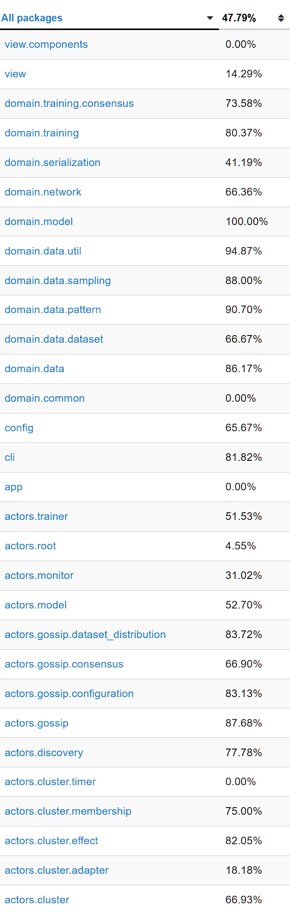

# 6. Testing
La validazione del sistema DNTS è stata condotta con l'obiettivo di garantire la correttezza matematica del modello, la robustezza del protocollo distribuito e la resilienza del sistema. L'architettura separata tra logica pura e gestione dello stato concorrente ha facilitato enormemente la stesura dei test, permettendo di isolare i componenti e verificarli in modo mirato.

## 6.1 Tecnologie Usate
Per la stesura e l'esecuzione della suite di test sono state adottate le seguenti tecnologie standard dell'ecosistema Scala:
* **ScalaTest:** Il framework principale utilizzato per la definizione di tutte le suite di test, sfruttando lo stile AnyWordSpec (e AnyFlatSpec) per garantire una sintassi leggibile e descrittiva.
* **Akka TestKit Typed:** Fornito nativamente dal framework Akka (ScalaTestWithActorTestKit), è stato fondamentale per testare il livello ad attori. Ha permesso di eseguire test asincroni in ambiente controllato, simulando lo scorrere del tempo e ispezionando le mailbox tramite i TestProbe.
* **sbt-scoverage:** Plugin per il build tool SBT utilizzato per misurare in modo rigoroso la code coverage.

## 6.2 Metodologia di Testing
#### Unit Testing sul Pure Functional Core
Il livello di dominio (matematica, reti neurali, euristiche di training e generazione dei dataset) è stato testato in totale isolamento. Essendo composto da funzioni pure e strutture dati immutabili, il testing è risultato diretto, privo di side-effect e senza alcuna necessità di utilizzare mock complessi. Sono stati verificati l'esattezza dei calcoli algebrici, la totale assenza di mutazioni di stato e il corretto funzionamento dei serializzatori custom.
#### Integration Testing sul Livello Distribuito
Per il livello concorrente i test si sono focalizzati sulle transizioni di stato (FSM) e sui protocolli di messaggistica. Utilizzando il TestKit, sono stati simulati gli scenari tipici del cluster: l'avvio della simulazione, lo scambio di pacchetti Gossip, l'applicazione asincrona dei gradienti e le interazioni fail-fast nella fase di configurazione (CLI e parsing dei file).

## 6.3 Grado di Copertura

    
     
    <em>Figura 11: Report di copertura per package generato tramite sbt-scoverage.</em>

Come illustrato nel report generato tramite sbt-scoverage, la suite di test garantisce una copertura eccellente in tutti i package nevralgici del sistema. I moduli centrali, come il core matematico (domain), le logiche di sincronizzazione e membership (cluster, gossip), e i meccanismi di validazione (config), presentano una coverage elevata. Questo assicura la totale affidabilità delle logiche di business, del calcolo distribuito e della resilienza del protocollo.

Nelle aree in cui la percentuale risulta fisiologicamente inferiore, la flessione è dovuta a una precisa e naturale scelta ingegneristica. Moduli come il Boundary Layer grafico (view) o le casistiche di errore di rete di bassissimo livello legate al framework Akka sono intrinsecamente difficili, se non impossibili, da testare in modo deterministico, o di scarso valore aggiunto rispetto alla solidità dimostrata nel resto dell'architettura.

---
[Vai al Capitolo 7: Retrospettiva -->](07-retrospettiva.md)